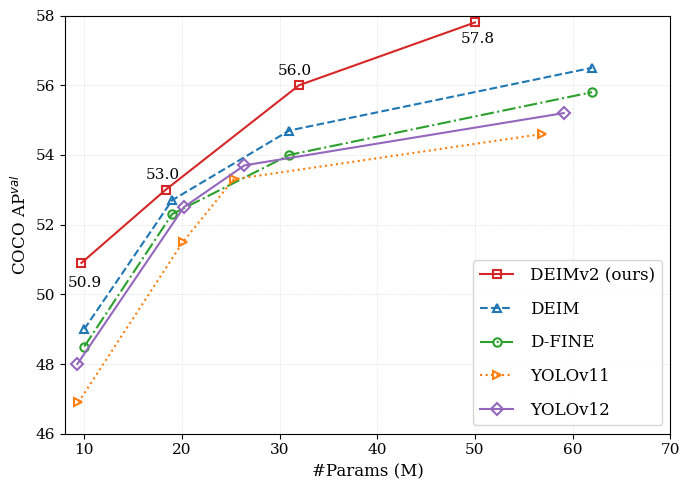

<h2 align="center">
  Real-Time Object Detection Meets DINOv3
</h2>

<p align="center">
    <a href="https://github.com/Intellindust-AI-Lab/DEIMv2/blob/master/LICENSE">
        
    </a>
    <a href="https://arxiv.org/abs/2509.20787">
        
    </a>
   <a href="https://intellindust-ai-lab.github.io/projects/DEIMv2/">
        
    </a>
    <a href="https://github.com/Intellindust-AI-Lab/DEIMv2/pulls">
        
    </a>
    <a href="https://github.com/Intellindust-AI-Lab/DEIMv2/issues">
        
    </a>
    <a href="https://github.com/Intellindust-AI-Lab/DEIMv2">
        
    </a>
    <a href="mailto:shenxi@intellindust.com">
        
    </a>
</p>

<p align="center">
    DEIMv2 is an evolution of the DEIM framework while leveraging the rich features from DINOv3. Our method is designed with various model sizes, from an ultra-light version up to S, M, L, and X, to be adaptable for a wide range of scenarios. Across these variants, DEIMv2 achieves state-of-the-art performance, with the S-sized model notably surpassing 50 AP on the challenging COCO benchmark.
</p>

---


<div align="center">
  <a href="http://www.shihuahuang.cn">Shihua Huang</a><sup>1*</sup>,&nbsp;&nbsp;
  Yongjie Hou<sup>1,2*</sup>,&nbsp;&nbsp;
  Longfei Liu<sup>1*</sup>,&nbsp;&nbsp;
  <a href="https://xuanlong-yu.github.io/">Xuanlong Yu</a><sup>1</sup>,&nbsp;&nbsp;
  <a href="https://xishen0220.github.io">Xi Shen</a><sup>1†</sup>&nbsp;&nbsp;
</div>

  
<p align="center">
<i>
1. <a href="https://intellindust-ai-lab.github.io"> Intellindust AI Lab</a> &nbsp;&nbsp; 2. Xiamen University &nbsp; <br> 
* Equal Contribution &nbsp;&nbsp; † Corresponding Author
</i>
</p>


<p align="center">
<strong>If you like our work, please give us a ⭐!</strong>
</p>


<p align="center">
  
  
</p>

</details>

 
  
## 🚀 Updates
- [x] **\[2025.10.2\]** [DEIMv2 has been integrated into X-AnyLabeling!](https://github.com/Intellindust-AI-Lab/DEIMv2/issues/25#issue-3473960491) Many thanks to the X-AnyLabeling maintainers for making this possible.
- [x] **\[2025.9.26\]** Release DEIMv2 series.

## 🧭 Table of Content
* [1. 🤖 Model Zoo](#1-model-zoo)
* [2. ⚡ Quick Start](#2-quick-start)
* [3. 🛠️ Usage](#3-usage)
* [4. 🧰 Tools](#4-tools)
* [5. 📜 Citation](#5-citation)
* [6. 🙏 Acknowledgement](#6-acknowledgement)
* [7. ⭐ Star History](#7-star-history)
  
  
## 1. Model Zoo

| Model | Dataset | AP | #Params | GFLOPs | Latency (ms) | config | checkpoint | log |
| :---: | :---: | :---: | :---: | :---: |:------------:| :---: | :---: | :---: |
| **Atto** | COCO | **23.8** | 0.5M | 0.8 |     1.10     | [yml](./configs/deimv2/deimv2_hgnetv2_atto_coco.yml) | [Google](https://drive.google.com/file/d/18sRJXX3FBUigmGJ1y5Oo_DPC5C3JCgYc/view?usp=sharing) / [Quark](https://pan.quark.cn/s/04c997582fca) | [Google](https://drive.google.com/file/d/1M7FLN8EeVHG02kegPN-Wxf_9BlkghZfj/view?usp=sharing) / [Quark](https://pan.quark.cn/s/7bf3548d3e10) |
| **Femto** | COCO | **31.0** | 1.0M | 1.7 |     1.45     | [yml](./configs/deimv2/deimv2_hgnetv2_femto_coco.yml) | [Google](https://drive.google.com/file/d/16hh6l9Oln9TJng4V0_HNf_Z7uYb7feds/view?usp=sharing) / [Quark](https://pan.quark.cn/s/169f3cefec1b) | [Google](https://drive.google.com/file/d/1_KWVfOr3bB5TMHTNOmDIAO-tZJmKB9-b/view?usp=sharing) / [Quark](https://pan.quark.cn/s/9dd5c4940199) |
| **Pico** | COCO | **38.5** | 1.5M | 5.2 |     2.13     | [yml](./configs/deimv2/deimv2_hgnetv2_pico_coco.yml) | [Google](https://drive.google.com/file/d/1PXpUxYSnQO-zJHtzrCPqQZ3KKatZwzFT/view?usp=sharing) / [Quark](https://pan.quark.cn/s/0db5b1dff721) | [Google](https://drive.google.com/file/d/1GwyWotYSKmFQdVN9k2MM6atogpbh0lo1/view?usp=sharing) / [Quark](https://pan.quark.cn/s/5ab2a74bb867) |
| **N** | COCO | **43.0** | 3.6M | 6.8 |     2.32     | [yml](./configs/deimv2/deimv2_hgnetv2_n_coco.yml) | [Google](https://drive.google.com/file/d/1G_Q80EVO4T7LZVPfHwZ3sT65FX5egp9K/view?usp=sharing) / [Quark](https://pan.quark.cn/s/1f626f191d11) | [Google](https://drive.google.com/file/d/1QhYfRrUy8HrihD3OwOMJLC-ATr97GInV/view?usp=sharing) / [Quark](https://pan.quark.cn/s/54e5c89675b3) |
| **S** | COCO | **50.9** | 9.7M | 25.6 |     5.78     | [yml](./configs/deimv2/deimv2_dinov3_s_coco.yml) | [Google](https://drive.google.com/file/d/1MDOh8UXD39DNSew6rDzGFp1tAVpSGJdL/view?usp=sharing) / [Quark](https://pan.quark.cn/s/f4d05c349a24) | [Google](https://drive.google.com/file/d/1ydA4lWiTYusV1s3WHq5jSxIq39oxy-Nf/view?usp=sharing) / [Quark](https://pan.quark.cn/s/277660d785d2) |
| **M** | COCO | **53.0** | 18.1M | 52.2 |     8.80     | [yml](./configs/deimv2/deimv2_dinov3_m_coco.yml) | [Google](https://drive.google.com/file/d/1nPKDHrotusQ748O1cQXJfi5wdShq6bKp/view?usp=sharing) / [Quark](https://pan.quark.cn/s/68a719248756) | [Google](https://drive.google.com/file/d/1i05Q1-O9UH-2Vb52FpFJ4mBG523GUqJU/view?usp=sharing) / [Quark](https://pan.quark.cn/s/32af04f3e4b4) |
| **L** | COCO | **56.0** | 32.2M | 96.7 |    10.47     | [yml](./configs/deimv2/deimv2_dinov3_l_coco.yml) | [Google](https://drive.google.com/file/d/1dRJfVHr9HtpdvaHlnQP460yPVHynMray/view?usp=sharing) / [Quark](https://pan.quark.cn/s/966b7ef89bdf) | [Google](https://drive.google.com/file/d/13mrQxyrf1kJ45Yd692UQwdb7lpGoqsiS/view?usp=sharing) / [Quark](https://pan.quark.cn/s/182bd52562a7) |
| **X** | COCO | **57.8** | 50.3M | 151.6 |    13.75     | [yml](./configs/deimv2/deimv2_dinov3_x_coco.yml) | [Google](https://drive.google.com/file/d/1pTiQaBGt8hwtO0mbYlJ8nE-HGztGafS7/view?usp=sharing) / [Quark](https://pan.quark.cn/s/038aa966b283) | [Google](https://drive.google.com/file/d/13QV0SwJw1wHl0xHWflZj1KstBUAovSsV/view?usp=drive_link) / [Quark](https://pan.quark.cn/s/333aba42b4bb) |


## 2. Quick start

### Setup

```shell
conda create -n deimv2 python=3.11 -y
conda activate deimv2
pip install -r requirements.txt
```


### Data Preparation

<details>
<summary> COCO2017 Dataset </summary>

1. Download COCO2017 from [OpenDataLab](https://opendatalab.com/OpenDataLab/COCO_2017) or [COCO](https://cocodataset.org/#download).
1. Modify paths in [coco_detection.yml](./configs/dataset/coco_detection.yml)

    ```yaml
    train_dataloader:
        img_folder: /data/COCO2017/train2017/
        ann_file: /data/COCO2017/annotations/instances_train2017.json
    val_dataloader:
        img_folder: /data/COCO2017/val2017/
        ann_file: /data/COCO2017/annotations/instances_val2017.json
    ```

</details>

<details>
<summary>Custom Dataset</summary>

To train on your custom dataset, you need to organize it in the COCO format. Follow the steps below to prepare your dataset:

1. **Set `remap_mscoco_category` to `False`:**

    This prevents the automatic remapping of category IDs to match the MSCOCO categories.

    ```yaml
    remap_mscoco_category: False
    ```

2. **Organize Images:**

    Structure your dataset directories as follows:

    ```shell
    dataset/
    ├── images/
    │   ├── train/
    │   │   ├── image1.jpg
    │   │   ├── image2.jpg
    │   │   └── ...
    │   ├── val/
    │   │   ├── image1.jpg
    │   │   ├── image2.jpg
    │   │   └── ...
    └── annotations/
        ├── instances_train.json
        ├── instances_val.json
        └── ...
    ```

    - **`images/train/`**: Contains all training images.
    - **`images/val/`**: Contains all validation images.
    - **`annotations/`**: Contains COCO-formatted annotation files.

3. **Convert Annotations to COCO Format:**

    If your annotations are not already in COCO format, you'll need to convert them. You can use the following Python script as a reference or utilize existing tools:

    ```python
    import json

    def convert_to_coco(input_annotations, output_annotations):
        # Implement conversion logic here
        pass

    if __name__ == "__main__":
        convert_to_coco('path/to/your_annotations.json', 'dataset/annotations/instances_train.json')
    ```

4. **Update Configuration Files:**

    Modify your [custom_detection.yml](./configs/dataset/custom_detection.yml).

    ```yaml
    task: detection

    evaluator:
      type: CocoEvaluator
      iou_types: ['bbox', ]

    num_classes: 777 # your dataset classes
    remap_mscoco_category: False

    train_dataloader:
      type: DataLoader
      dataset:
        type: CocoDetection
        img_folder: /data/yourdataset/train
        ann_file: /data/yourdataset/train/train.json
        return_masks: False
        transforms:
          type: Compose
          ops: ~
      shuffle: True
      num_workers: 4
      drop_last: True
      collate_fn:
        type: BatchImageCollateFunction

    val_dataloader:
      type: DataLoader
      dataset:
        type: CocoDetection
        img_folder: /data/yourdataset/val
        ann_file: /data/yourdataset/val/ann.json
        return_masks: False
        transforms:
          type: Compose
          ops: ~
      shuffle: False
      num_workers: 4
      drop_last: False
      collate_fn:
        type: BatchImageCollateFunction
    ```

</details>

### Backbone Checkpoints

For DINOv3 S and S+, download them following the guide in https://github.com/facebookresearch/dinov3

For our distilled ViT-Tiny and ViT-Tiny+, you can download them from [ViT-Tiny](https://drive.google.com/file/d/1YMTq_woOLjAcZnHSYNTsNg7f0ahj5LPs/view?usp=sharing) and [ViT-Tiny+](https://drive.google.com/file/d/1COHfjzq5KfnEaXTluVGEOMdhpuVcG6Jt/view?usp=sharing).

Then place them into ./ckpts as:

```shell
ckpts/
├── dinov3_vits16.pth
├── vitt_distill.pt
├── vittplus_distill.pt
└── ...
```


## 3. Usage
<details open>
<summary> COCO2017 </summary>

1. Training
```shell
# for ViT-based variants
CUDA_VISIBLE_DEVICES=0,1,2,3 torchrun --master_port=7777 --nproc_per_node=4 train.py -c configs/deimv2/deimv2_dinov3_${model}_coco.yml --use-amp --seed=0

# for HGNetv2-based variants
CUDA_VISIBLE_DEVICES=0,1,2,3 torchrun --master_port=7777 --nproc_per_node=4 train.py -c configs/deimv2/deimv2_hgnetv2_${model}_coco.yml --use-amp --seed=0
```

<!-- <summary>2. Testing </summary> -->
2. Testing
```shell
# for ViT-based variants
CUDA_VISIBLE_DEVICES=0,1,2,3 torchrun --master_port=7777 --nproc_per_node=4 train.py -c configs/deimv2/deimv2_dinov3_${model}_coco.yml --test-only -r model.pth

# for HGNetv2-based variants
CUDA_VISIBLE_DEVICES=0,1,2,3 torchrun --master_port=7777 --nproc_per_node=4 train.py -c configs/deimv2/deimv2_hgnetv2_${model}_coco.yml --test-only -r model.pth
```

<!-- <summary>3. Tuning </summary> -->
3. Tuning
```shell
# for ViT-based variants
CUDA_VISIBLE_DEVICES=0,1,2,3 torchrun --master_port=7777 --nproc_per_node=4 train.py -c configs/deimv2/deimv2_dinov3_${model}_coco.yml --use-amp --seed=0 -t model.pth

# for HGNetv2-based variants
CUDA_VISIBLE_DEVICES=0,1,2,3 torchrun --master_port=7777 --nproc_per_node=4 train.py -c configs/deimv2/deimv2_hgnetv2_${model}_coco.yml --use-amp --seed=0 -t model.pth
```
</details>

<details>
<summary> Customizing Batch Size </summary>

For example, if you want to use **DEIMv2-S** and  double the total batch size to 64 when training **DEIMv2** on COCO2017, here are the steps you should follow:

1. **Modify your [deimv2_dinov3_s_coco.yml](./configs/deimv2/deimv2_dinov3_s_coco.yml)** to increase the `total_batch_size`:

    ```yaml
    train_dataloader:
      total_batch_size: 64 
      dataset: 
        transforms:
          ops:
            ...
    
      collate_fn:
        ...
    ```

2. **Modify your [deimv2_dinov3_s_coco.yml](./configs/deimv2/deimv2_dinov3_s_coco.yml)**. Here’s how the key parameters should be adjusted:

    ```yaml
    optimizer:
      type: AdamW
    
      params: 
        -
          # except norm/bn/bias in self.dinov3
          params: '^(?=.*.dinov3)(?!.*(?:norm|bn|bias)).*$'  
          lr: 0.00005  # doubled, linear scaling law
        -
          # including all norm/bn/bias in self.dinov3
          params: '^(?=.*.dinov3)(?=.*(?:norm|bn|bias)).*$'    
          lr: 0.00005   # doubled, linear scaling law
          weight_decay: 0.
        - 
          # including all norm/bn/bias except for the self.dinov3
          params: '^(?=.*(?:sta|encoder|decoder))(?=.*(?:norm|bn|bias)).*$'
          weight_decay: 0.
    
      lr: 0.0005   # linear scaling law if needed
      betas: [0.9, 0.999]
      weight_decay: 0.0001
   
    ema:  # added EMA settings
      decay: 0.9998  # adjusted by 1 - (1 - decay) * 2
      warmups: 500  # halved
   
    lr_warmup_scheduler:
      warmup_duration: 250  # halved
    ```

</details>


<details>
<summary> Customizing Input Size </summary>

If you'd like to train **DEIMv2-S** on COCO2017 with an input size of 320x320, follow these steps:

1. **Modify your  [deimv2_dinov3_s_coco.yml](./configs/deimv2/deimv2_dinov3_s_coco.yml)**:

    ```yaml
    eval_spatial_size: [320, 320]
   
    train_dataloader:
      # Here we set the total_batch_size to 64 as an example.
      total_batch_size: 64 
      dataset: 
        transforms:
          ops:
            #  Especially for Mosaic augmentation, it is recommended that output_size = input_size / 2.
            - {type: Mosaic, output_size: 160, rotation_range: 10, translation_range: [0.1, 0.1], scaling_range: [0.5, 1.5],
               probability: 1.0, fill_value: 0, use_cache: True, max_cached_images: 50, random_pop: True}
            ...
            - {type: Resize, size: [320, 320], }
            ...
        collate_fn:
          base_size: 320
          ...

    val_dataloader:
      dataset:
        transforms:
          ops:
            - {type: Resize, size: [320, 320], }
            ...
    ```
   
</details>

<details>
<summary> Customizing Epoch </summary>

If you want to finetune **DEIMv2-S** for **20** epochs, follow these steps (for reference only; feel free to adjust them according to your needs):

```yml
epoches: 32 #  Total epochs: 20 for training + EMA  for 4n = 12. n refers to the model size in the matched config.

flat_epoch: 14    # 4 + 20 // 2
no_aug_epoch: 12  # 4n

train_dataloader:
  dataset: 
    transforms:
      ops:
        ...
      policy:
        epoch: [4, 14, 20]   # [start_epoch, flat_epoch, epoches - no_aug_epoch]

  collate_fn:
    ...
    mixup_epochs: [4, 14]  # [start_epoch, flat_epoch]
    stop_epoch: 20  # epoches - no_aug_epoch
    copyblend_epochs: [4, 20]  # [start_epoch, epoches - no_aug_epoch]
  
DEIMCriterion:
  matcher:
    ...
    matcher_change_epoch: 18  # ~90% of (epoches - no_aug_epoch)

```

</details>

## 4. Tools
<details>
<summary> Deployment </summary>

<!-- <summary>4. Export onnx </summary> -->
1. Setup
```shell
pip install onnx onnxsim
```

2. Export onnx
```shell
python tools/deployment/export_onnx.py --check -c configs/deimv2/deimv2_dinov3_${model}_coco.yml -r model.pth
```

3. Export [tensorrt](https://docs.nvidia.com/deeplearning/tensorrt/install-guide/index.html)
```shell
trtexec --onnx="model.onnx" --saveEngine="model.engine" --fp16
```

</details>

<details>
<summary> Inference (Visualization) </summary>


1. Setup
```shell
pip install -r tools/inference/requirements.txt
```


<!-- <summary>5. Inference </summary> -->
2. Inference (onnxruntime / tensorrt / torch)

Inference on images and videos is now supported.
```shell
python tools/inference/onnx_inf.py --onnx model.onnx --input image.jpg  # video.mp4
python tools/inference/trt_inf.py --trt model.engine --input image.jpg
python tools/inference/torch_inf.py -c configs/deimv2/deimv2_dinov3_${model}_coco.yml -r model.pth --input image.jpg --device cuda:0
```
</details>

<details>
<summary> Benchmark </summary>

1. Setup
```shell
pip install -r tools/benchmark/requirements.txt
```

<!-- <summary>6. Benchmark </summary> -->
2. Model FLOPs, MACs, and Params
```shell
python tools/benchmark/get_info.py -c configs/deimv2/deimv2_dinov3_${model}_coco.yml
```

2. TensorRT Latency
```shell
python tools/benchmark/trt_benchmark.py --COCO_dir path/to/COCO2017 --engine_dir model.engine
```
</details>

<details>
<summary> Fiftyone Visualization  </summary>

1. Setup
```shell
pip install fiftyone
```
4. Voxel51 Fiftyone Visualization ([fiftyone](https://github.com/voxel51/fiftyone))
```shell
python tools/visualization/fiftyone_vis.py -c configs/deimv2/deimv2_dinov3_${model}_coco.yml -r model.pth
```
</details>

<details>
<summary> Others </summary>

1. Auto Resume Training
```shell
bash reference/safe_training.sh
```

2. Converting Model Weights
```shell
python reference/convert_weight.py model.pth
```
</details>


## 5. Citation
If you use `DEIMv2` or its methods in your work, please cite the following BibTeX entries:
<details open>
<summary> bibtex </summary>

```latex
@article{huang2025deimv2,
  title={Real-Time Object Detection Meets DINOv3},
  author={Huang, Shihua and Hou, Yongjie and Liu, Longfei and Yu, Xuanlong and Shen, Xi},
  journal={arXiv},
  year={2025}
}
  
```
</details>

## 6. Acknowledgement
Our work is built upon [D-FINE](https://github.com/Peterande/D-FINE), [RT-DETR](https://github.com/lyuwenyu/RT-DETR), [DEIM](https://github.com/ShihuaHuang95/DEIM), and [DINOv3](https://github.com/facebookresearch/dinov3). Thanks for their great work!

✨ Feel free to contribute and reach out if you have any questions! ✨

## 7. Star History

[](https://www.star-history.com/#Intellindust-AI-Lab/DEIMv2&Date)
